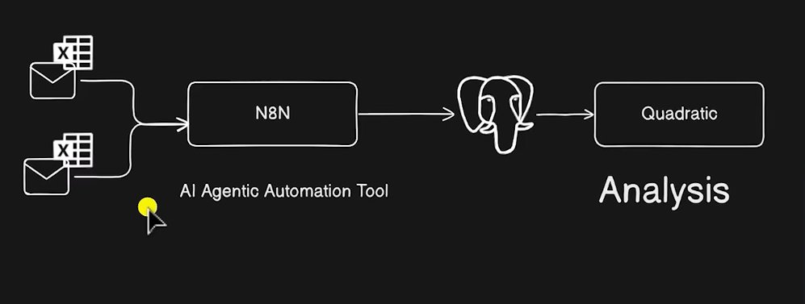
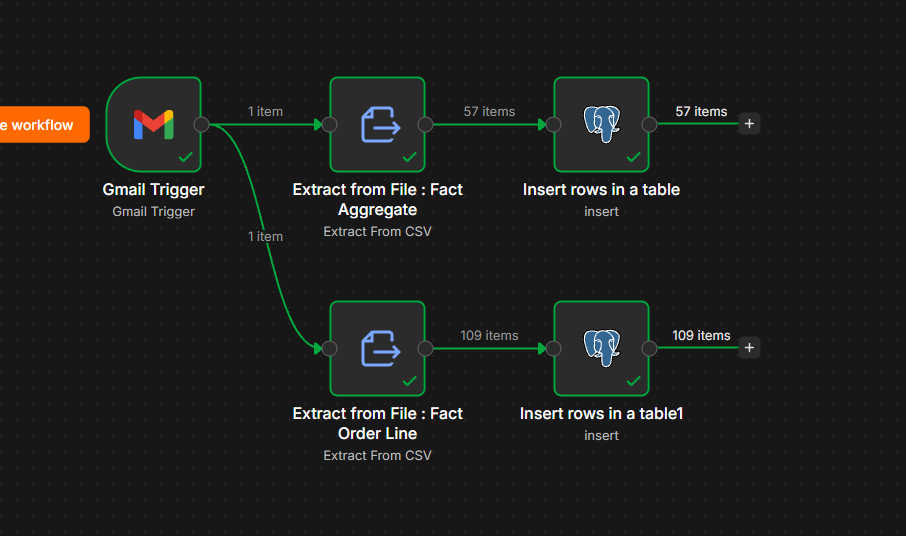

# Supply Chain Analytics Using AI

Welcome to the **Supply Chain Analytics Using AI** repository! 📦📊
This project demonstrates an AI-powered analytics pipeline for **AtliQ Mart**, an organic food manufacturer, that automatically moves order data from email into a database and analyses supply chain performance with prompt-based AI. Built as a project to explore workflow automation and AI spreadsheets together, it highlights practical applications of data analytics in supply chain management.

---
## 🏗️ System Architecture

The pipeline follows four stages, **Email → N8N → Postgres → Quadratic**:



1. **Data Source (Email)**: Daily sales data arrives as CSV attachments in a Gmail inbox (it could come from other sources too).
2. **Automation (N8N)**: An AI agentic automation tool monitors the inbox, downloads the attachments, extracts the CSV data and inserts it into the database.
3. **Storage (Postgres)**: Order data is stored in Postgres (hosted via Supabase) as fact and dimension tables.
4. **Analysis (Quadratic)**: An AI-powered spreadsheet pulls the data from Postgres, and prompt-based analysis calculates the supply chain KPIs.

---
## 📖 Project Overview

**Business problem:** AtliQ Mart is a Gujarat-based organic food manufacturer operating in two Indian cities and recently expanded to New Jersey, USA. Some supermarket customers are dissatisfied with order management, a classic supply chain issue caused by not maintaining optimum inventory. Leadership wanted an AI-powered solution before scaling further.

This project involves:

1. **Workflow Automation**: Building an N8N workflow that watches a Gmail inbox and loads new order data into Postgres automatically.
2. **Data Preparation**: Creating `dim_date` and `exchange_rates` tables, then cleaning and merging the order, product, customer and exchange-rate data.
3. **KPI Calculation**: Computing Total Orders, Order Lines, Line Fill Rate, Volume Fill Rate, On Time %, In Full % and OTIF % using Python in Quadratic.
4. **Supply Chain Domain Learning**: Understanding what each metric means and which supply chain team uses it.



🎯 This repository is a useful resource for professionals and students looking to showcase expertise in:
- Supply Chain Analytics
- Workflow Automation (N8N)
- SQL / Postgres
- AI-Assisted Data Analysis (Quadratic)
- Python (pandas) for KPI Calculation

---

## 🛠️ Tools Used

- **N8N:** AI agentic automation tool that monitors Gmail and migrates data into Postgres.
- **Gmail:** Source of the daily sales CSV attachments.
- **Postgres (via Supabase):** Database that stores the fact and dimension tables.
- **Quadratic:** AI-powered spreadsheet with a Postgres connection, Python support and prompt-based analysis.
- **Python (pandas):** Data cleaning, merging and KPI calculation.
- **SQL:** Querying tables from Postgres into Quadratic.
- **Open Exchange Rates API:** Historical USD to INR exchange rates.

---

## 🚀 Project Requirements

### Building the Supply Chain Analytics Pipeline (Automation & Analysis)

#### Objective
Automate the movement of order data from email to a database, and analyse it with an AI spreadsheet to measure delivery performance and identify supply chain issues.

#### Specifications
- **Data Source**: Daily sales emails with two CSV attachments: `fact_order_line` (one row per product in an order) and `fact_orders_aggregate` (one row per order).
- **Automation**: N8N Gmail trigger (event: Message Received, filter: INBOX plus a subject search such as `subject:daily sales`, attachments downloaded) feeding Extract From CSV and Postgres Insert nodes.
- **Database Tables**: `dim_customers`, `dim_products`, `dim_target_orders`, `fact_order_line`, `fact_orders_aggregate`, plus `dim_date` and `exchange_rates` created in Quadratic.
- **Analysis Period**: 1 March 2025 to 31 May 2025 (exchange rates fetched up to 17 May 2025).
- **Cleaning**: Convert IDs to integers, strip whitespace, remove NULL IDs, convert dates to datetime, merge orders with products, customers and exchange rates, and calculate `total_amount` in INR.
- **Documentation**: Step-by-step walkthrough of the automation, prompts and KPI logic (see the report).

---

## 📏 KPI Definitions

| KPI | Level | Formula |
|---|---|---|
| Total Orders | Order | Count of unique orders |
| Total Order Lines | Order line | Count of rows in `fact_order_line` |
| Line Fill Rate (LFR) | Order line | Order lines delivered in full ÷ Total order lines |
| Volume Fill Rate (VOFR) | Quantity | Quantity delivered ÷ Quantity ordered |
| On Time % (OT) | Order | Orders delivered on time ÷ Total orders |
| In Full % (IF) | Order | Orders delivered in full ÷ Total orders |
| **OTIF %** | Order | Orders delivered on time **and** in full ÷ Total orders |

> **Why OTIF is "harsh":** an order counts only if *every* line is delivered in full and on time. If 499 of 500 products arrive perfectly but one is short, the whole order scores 0.

### Example KPI code (Quadratic)

```python
import pandas as pd

# Get order line data
order_lines = q.cells("'fact_order_line'!A2:K24532", first_row_header=True)
order_agg = q.cells("'fact_aggregate'!A2:F13654", first_row_header=True)

# Calculate KPIs
total_order_lines = len(order_lines)
line_fill_rate = (order_lines['In Full'] == '1').mean() * 100
volume_fill_rate = (order_lines['delivery_qty'].sum() / order_lines['order_qty'].sum()) * 100
total_orders = len(order_agg)
on_time_delivery = (order_agg['on_time'] == 1).mean() * 100
in_full_delivery = (order_agg['in_full'] == '1').mean() * 100
otif = (order_agg['otif'] == '1').mean() * 100
```

---
## 📊 Result & Outcome

An N8N workflow now monitors the Gmail inbox, extracts the CSV attachments and inserts the rows into Postgres without manual effort (a test run loaded 57 aggregate rows and 109 order-line rows). The data is queried into Quadratic, cleaned and merged with Python, and used to calculate the core supply chain KPIs (fill rates, on-time, in-full and OTIF) from natural-language prompts, replacing manual Excel work.

---

## 🔭 Future Scope

- **Dashboarding**: Build a Power BI or Quadratic dashboard to track KPIs over time and by customer, city and product.
- **Inventory Optimisation**: Use the KPIs and target orders data to forecast demand and recommend optimum stock levels.
- **More Data Sources**: Extend the N8N workflow beyond email (APIs, cloud storage, ERP systems).
- **Automated Alerts**: Notify the supply team on Slack or email when OTIF drops below a target.

---

## 🛡️ License

This project is licensed under the [MIT License](LICENSE). You are free to use, modify, and share this project with proper attribution.

## 🌟 About Me

**Jeremy David Christopher**
Aspiring Data Analyst
Skills: SQL | Excel | Power BI | Data Analytics

🔗 LinkedIn: https://www.linkedin.com/in/jeremy-david-643870201/

Let's stay in touch!
